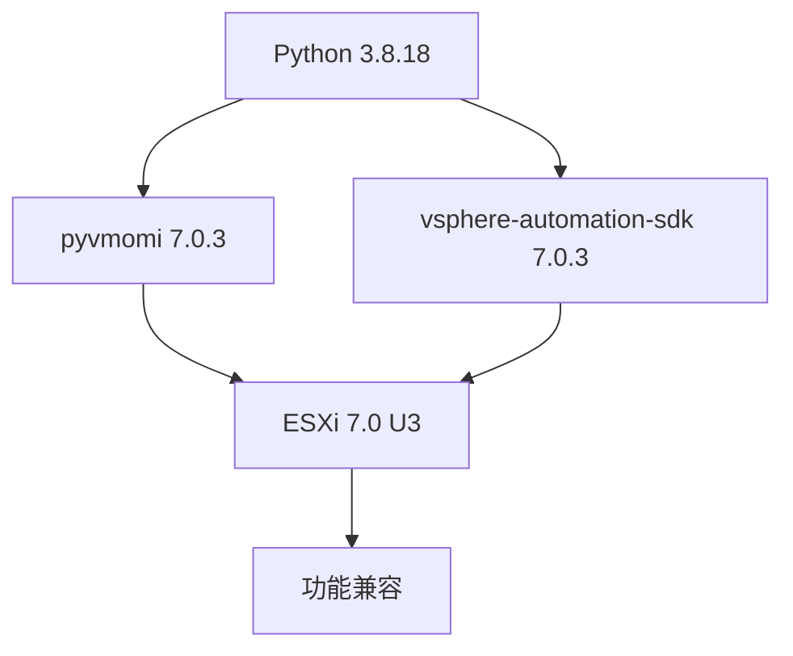

# ESXi 7.0 Update 3 Python 开发环境配置指南

## 一、核心依赖库列表

以下是操作 ESXi 7.0 Update 3 所需的完整 Python 库清单：

| 包名 | 版本 | 作用 | 安装命令 |
|------|------|------|---------|
| pyvmomi | 7.0.3 | ESXi API 核心库 | `pip install pyvmomi==7.0.3` |
| vsphere-automation-sdk | 7.0.3 | vSphere 自动化 SDK | `pip install vsphere-automation-sdk==7.0.3` |
| requests | 2.25.1 | HTTP 请求库 | `pip install requests==2.25.1` |
| pyopenssl | 19.1.0 | OpenSSL 支持 | `pip install pyopenssl==19.1.0` |
| cryptography | 3.4.8 | 加密支持 | `pip install cryptography==3.4.8` |
| six | 1.16.0 | Python 2/3 兼容 | `pip install six==1.16.0` |
| lxml | 4.6.3 | XML 处理 | `pip install lxml==4.6.3` |
| tabulate | 0.8.9 | 表格输出 | `pip install tabulate==0.8.9` |

## 二、完整安装命令

```bash
# 激活虚拟环境
source /data/pypro_example/venv/bin/activate

# 安装所有依赖
pip install pyvmomi==7.0.3 \
            vsphere-automation-sdk==7.0.3 \
            requests==2.25.1 \
            pyopenssl==19.1.0 \
            cryptography==3.4.8 \
            six==1.16.0 \
            lxml==4.6.3 \
            tabulate==0.8.9
```

## 三、版本兼容性说明



## 四、验证安装

```python
# check_install.py
import pyVim
from pyVmomi import vim
from vmware.vapi import bindings

print("=== 安装验证 ===")
print(f"pyvmomi 版本: {pyVim.version}")
print(f"vAPI 版本: {bindings.VAPI_VERSION}")

# 检查关键模块
required_modules = [
    'pyVim', 'pyVmomi', 'vmware.vapi', 
    'OpenSSL', 'cryptography', 'lxml'
]

print("\n=== 模块检查 ===")
for module in required_modules:
    try:
        __import__(module)
        print(f"✅ {module} 已安装")
    except ImportError:
        print(f"❌ {module} 未安装")
```

运行验证脚本：
```bash
python check_install.py
```

预期输出：
```
=== 安装验证 ===
pyvmomi 版本: 7.0.3
vAPI 版本: 7.0.3.0

=== 模块检查 ===
✅ pyVim 已安装
✅ pyVmomi 已安装
✅ vmware.vapi 已安装
✅ OpenSSL 已安装
✅ cryptography 已安装
✅ lxml 已安装
```

## 五、基础连接示例

```python
# esxi_connect.py
from pyVim.connect import SmartConnect, Disconnect
import ssl

def connect_esxi(host, user, password):
    # 创建SSL上下文
    context = ssl.SSLContext(ssl.PROTOCOL_TLS_CLIENT)
    context.check_hostname = False
    context.verify_mode = ssl.CERT_NONE
    
    try:
        # 连接ESXi
        si = SmartConnect(
            host=host,
            user=user,
            pwd=password,
            sslContext=context
        )
        print(f"✅ 成功连接到 {host}")
        
        # 获取主机信息
        content = si.RetrieveContent()
        host = content.rootFolder.childEntity[0].hostFolder.childEntity[0].host[0]
        print(f"主机名: {host.name}")
        print(f"ESXi版本: {host.summary.config.product.version}")
        print(f"CPU核心数: {host.hardware.cpuInfo.numCpuCores}")
        print(f"内存总量: {host.hardware.memorySize // (1024*1024)} MB")
        
        # 断开连接
        Disconnect(si)
        return True
    except Exception as e:
        print(f"❌ 连接失败: {str(e)}")
        return False

if __name__ == "__main__":
    connect_esxi("esxi_host_ip", "root", "your_password")
```

## 六、常用操作示例

### 1. 列出所有虚拟机
```python
def list_vms(si):
    content = si.RetrieveContent()
    container = content.viewManager.CreateContainerView(
        content.rootFolder, [vim.VirtualMachine], True
    )
    
    print("\n=== 虚拟机列表 ===")
    vms = []
    for vm in container.view:
        vms.append([
            vm.name,
            vm.runtime.powerState,
            vm.config.hardware.numCPU,
            vm.config.hardware.memoryMB,
            vm.config.guestFullName
        ])
    
    # 使用tabulate美化输出
    from tabulate import tabulate
    print(tabulate(vms, headers=["名称", "状态", "CPU", "内存(MB)", "操作系统"]))
```

### 2. 创建虚拟机
```python
def create_vm(si, vm_name):
    content = si.RetrieveContent()
    resource_pool = content.rootFolder.childEntity[0].resourcePool
    datastore = content.rootFolder.childEntity[0].datastore[0]
    
    # 虚拟机配置
    config = vim.vm.ConfigSpec(
        name=vm_name,
        memoryMB=4096,
        numCPUs=2,
        guestId="centos7_64Guest",
        files=vim.vm.FileInfo(
            vmPathName=f"[{datastore.name}]"
        )
    )
    
    # 创建虚拟机
    task = resource_pool.CreateVm(config, content.rootFolder)
    WaitForTask(task)
    print(f"✅ 虚拟机 {vm_name} 创建成功")
```

### 3. 虚拟机电源操作
```python
def vm_power(vm_name, operation):
    vm = get_vm_by_name(vm_name)
    if not vm:
        return
    
    if operation == "on":
        if vm.runtime.powerState != "poweredOn":
            task = vm.PowerOn()
            WaitForTask(task)
            print(f"✅ 已启动虚拟机 {vm_name}")
    elif operation == "off":
        if vm.runtime.powerState != "poweredOff":
            task = vm.PowerOff()
            WaitForTask(task)
            print(f"✅ 已关闭虚拟机 {vm_name}")
    elif operation == "reset":
        task = vm.Reset()
        WaitForTask(task)
        print(f"✅ 已重启虚拟机 {vm_name}")
```

## 七、辅助工具函数

### 1. 任务等待函数
```python
def WaitForTask(task):
    """等待任务完成"""
    while task.info.state not in [vim.TaskInfo.State.success, vim.TaskInfo.State.error]:
        time.sleep(1)
    if task.info.state == vim.TaskInfo.State.error:
        raise Exception(f"任务失败: {task.info.error}")
    return task.info.result
```

### 2. 虚拟机查找函数
```python
def get_vm_by_name(content, vm_name):
    """按名称查找虚拟机"""
    container = content.viewManager.CreateContainerView(
        content.rootFolder, [vim.VirtualMachine], True
    )
    for vm in container.view:
        if vm.name == vm_name:
            return vm
    print(f"❌ 未找到虚拟机: {vm_name}")
    return None
```

## 八、生产环境最佳实践

### 1. 配置文件管理
```python
# config.py
ESXI_CONFIG = {
    "host": "esxi_host_ip",
    "user": "admin_user",
    "password": "secure_password",
    "port": 443
}
```

### 2. 安全连接增强
```python
def secure_connect(config):
    """安全连接ESXi"""
    context = ssl.SSLContext(ssl.PROTOCOL_TLS_CLIENT)
    context.check_hostname = True
    context.verify_mode = ssl.CERT_REQUIRED
    context.load_verify_locations(cafile="esxi_cert.pem")
    
    return SmartConnect(
        host=config["host"],
        user=config["user"],
        pwd=config["password"],
        port=config["port"],
        sslContext=context
    )
```

### 3. 错误处理框架
```python
def esxi_operation(func):
    """ESXi操作装饰器"""
    def wrapper(*args, **kwargs):
        try:
            return func(*args, **kwargs)
        except vim.fault.NoPermission as e:
            print(f"权限不足: {e.privilegeId}")
        except vim.fault.InvalidState as e:
            print(f"无效状态: {e}")
        except Exception as e:
            print(f"未知错误: {str(e)}")
            # 发送警报
            send_alert(f"ESXi操作失败: {str(e)}")
    return wrapper
```

## 九、完整项目结构建议

```
/data/pypro_example/
├── venv/                  # 虚拟环境
├── src/
│   ├── esxi/              # ESXi操作模块
│   │   ├── __init__.py
│   │   ├── connect.py      # 连接管理
│   │   ├── vm_ops.py       # 虚拟机操作
│   │   └── storage.py      # 存储管理
│   ├── utils/             # 工具函数
│   │   ├── task_utils.py
│   │   └── error_handling.py
│   └── main.py            # 主程序
├── config/                # 配置文件
│   ├── esxi_config.yaml
│   └── certs/             # 证书目录
├── requirements.txt        # 依赖列表
└── README.md              # 项目文档
```

## 十、升级和维护

### 1. 定期更新依赖
```bash
# 检查更新
pip list --outdated

# 安全更新
pip install --upgrade pyvmomi requests
```

### 2. 版本兼容性检查
```python
# 检查ESXi版本兼容性
def check_compatibility(si):
    about = si.content.about
    print(f"ESXi版本: {about.version}")
    print(f"API版本: {about.apiVersion}")
    
    # SDK支持矩阵
    sdk_versions = {
        "7.0.3": ["7.0.0", "7.0.1", "7.0.2", "7.0.3"]
    }
    
    current_sdk = "7.0.3"
    if about.version not in sdk_versions[current_sdk]:
        print(f"⚠️ 警告: SDK {current_sdk} 可能不完全兼容 ESXi {about.version}")
```

## 总结

通过以上配置，您可以在 Python 3.8.18 环境中安全高效地操作 ESXi 7.0 Update 3 系统。关键点包括：

1. 精确版本控制：使用指定版本的依赖库
2. 安全连接：正确处理 SSL/TLS 证书
3. 错误处理：完善的异常捕获机制
4. 模块化设计：分离连接、操作和工具函数

建议将常用操作封装成模块化函数，并通过配置文件管理连接信息，以提高代码的复用性和安全性。